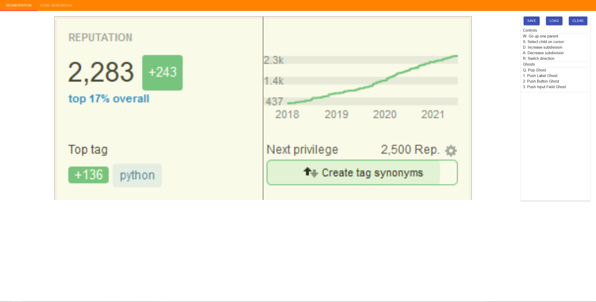
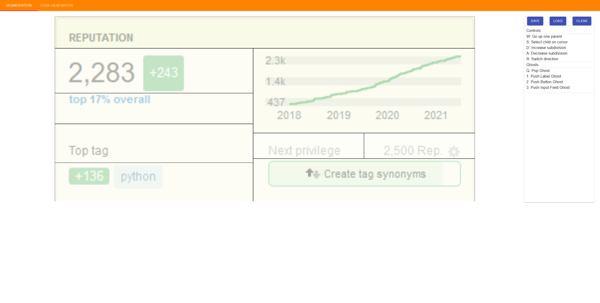
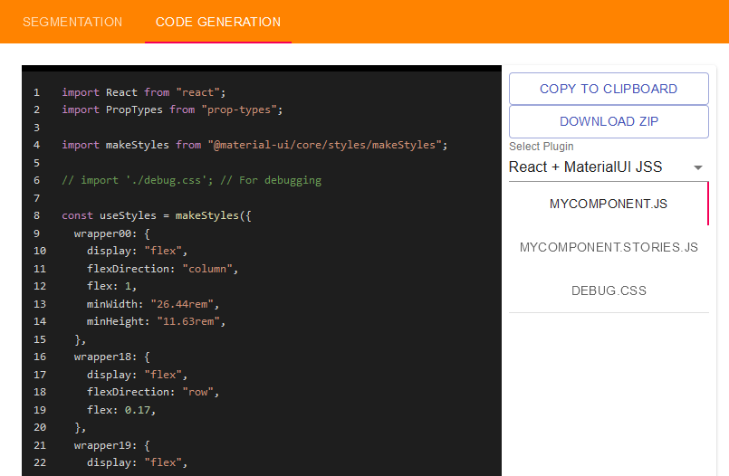
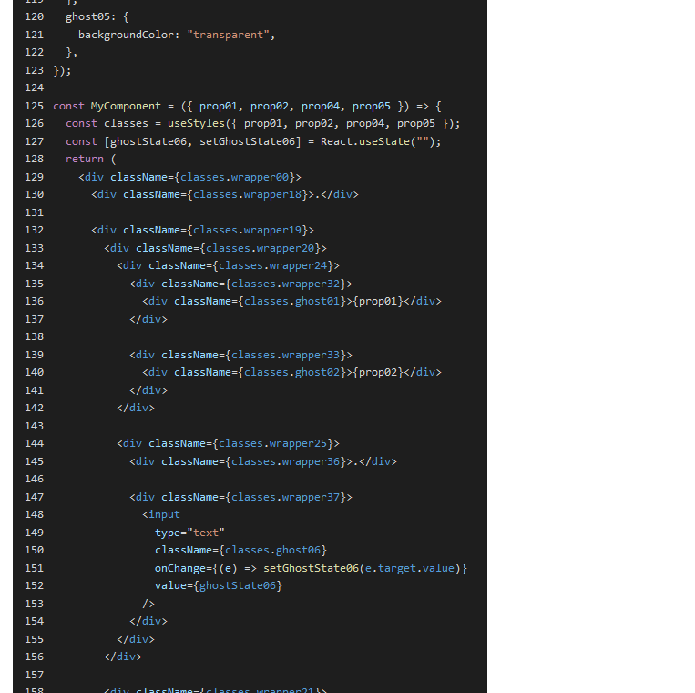

# Speed Flexbox (early access)

Generate flex-box boilerplate quickly

## Usage

1. Visit the site hosted here <https://ghost---shadow.github.io/speed-flexbox/>
2. Drag and drop an image of the design of your choice onto the canvas

3. Slice the image into sections. These will be converted into the DOM hierarchy

4. Add placeholders (ghosts) for any input fields, or labels or buttons. These will be connected with React states or props

5. Click the code generation tab and select the generation plugin of your choice

6. Click the `Copy to Clipboard` button and copy the generated code to your file.
7. Rename the variables to human readable names (VSCode: Ctrl + Shift + L)

## Planned features

* More plugins
* More ghosts
